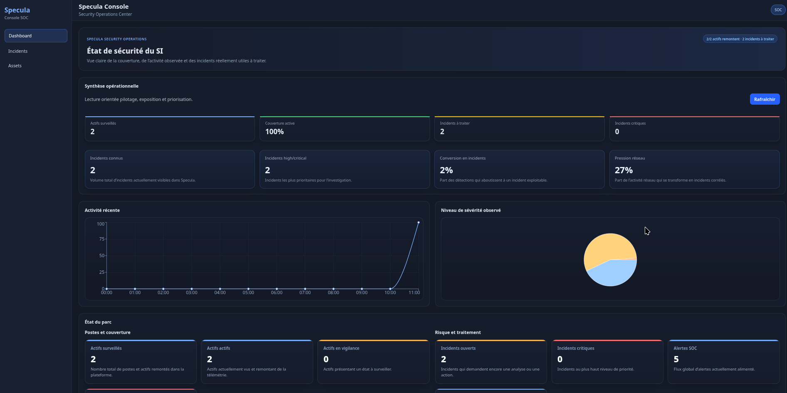
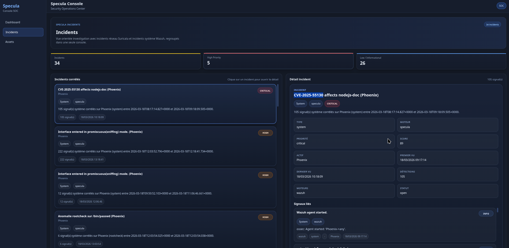

# 🛡️ Specula — Détection d’intrusion simple et rapide

Specula est une plateforme SOC open-source permettant de détecter et analyser des activités suspectes sur votre infrastructure en quelques minutes.

👉 Basé sur Wazuh + Suricata, avec une interface moderne prête à l’emploi.

---




---

## 🚀 Pourquoi Specula ?

Mettre en place un SOC est souvent complexe.

Specula simplifie cette approche :

- 🔍 Collecte d’événements (Wazuh, Suricata)
- ⚡ Corrélation d’incidents
- 📊 Interface claire pour investigation
- 🧪 Mode démo prêt à l’emploi
- 🐳 Déploiement en une commande avec Docker

---

## 🎯 Pour qui ?

- Développeurs
- Freelances
- Startups
- PME sans équipe sécurité
- Toute personne souhaitant surveiller son infrastructure simplement

---

## ⚡ Installation (1 commande)

```bash
git clone git@github.com:P-axel/specula.git
cd specula
chmod +x start-specula.sh
./start-specula.sh
```

---

## ⚙️ Prérequis

- Docker
- Docker Compose

---

## 🌐 Accès

Une fois lancé :

- 🖥 Interface : http://localhost:5173
- 🔌 API : http://localhost:8000

⏳ Le premier démarrage peut prendre quelques minutes.

---

## 🧪 Mode démo (par défaut)

Specula démarre automatiquement avec :

- incidents simulés
- alertes Wazuh / Suricata mockées
- corrélation active

👉 Aucun agent requis pour tester  
👉 Vous pouvez voir immédiatement comment fonctionne la détection

---

## 🔌 Mode réel (optionnel)

Vous pouvez connecter votre infrastructure réelle.

---

### 🔹 Wazuh (endpoints)

#### Linux

```bash
curl -so wazuh-agent.deb https://packages.wazuh.com/4.x/apt/pool/main/w/wazuh-agent/wazuh-agent_4.x_amd64.deb
sudo WAZUH_MANAGER='IP_DU_SERVEUR' dpkg -i wazuh-agent.deb
sudo systemctl start wazuh-agent
```

#### Windows

- Télécharger l’agent Wazuh
- Configurer l’IP du manager
- Démarrer le service

---

### 🔹 Suricata (réseau)

```bash
sudo apt install suricata
```

Configurer `eve.json` :

```yaml
outputs:
  - eve-log:
      enabled: yes
      filename: /var/log/suricata/eve.json
```

---

## ⚙️ Configuration

Modifier `.env` :

```env
USE_FIXTURES=true
```

- `true` → mode démo  
- `false` → mode réel  

---

## 🧠 Architecture

Specula est structuré en modules :

- `specula-core` → API + moteur de corrélation  
- `specula-console` → interface utilisateur  
- `connectors` → intégration Wazuh / Suricata  
- `fixtures` → simulation pour tests  

---

## 🧪 Cas d’usage

- Surveiller un serveur (VPS)  
- Détecter des tentatives d’intrusion  
- Visualiser les événements de sécurité  
- Mettre en place une base SOC rapidement  

---

## 🧯 Dépannage rapide

- Vérifier que Docker est lancé  
- Vérifier les ports disponibles (5173, 8000)  
- Attendre quelques minutes au premier démarrage  

Logs :

```bash
docker compose logs -f
```

---

## 🚀 Roadmap

- 🔥 Scoring intelligent  
- ⚡ Corrélation temps réel avancée  
- 🧭 Mapping MITRE ATT&CK  
- 🏢 Multi-tenant SOC  

---

## 💼 Besoin d’aide ?

Je propose :

- installation complète  
- configuration adaptée à votre infrastructure  
- mise en place des alertes  
- accompagnement sécurité  

👉 Contact : (ton mail ou LinkedIn)

---

## 📄 Licence

MIT
